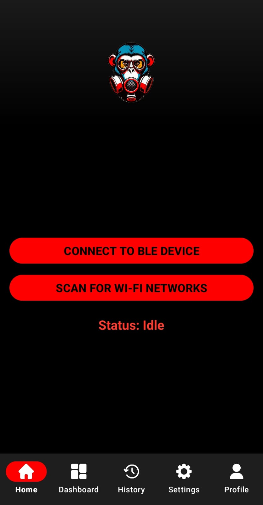
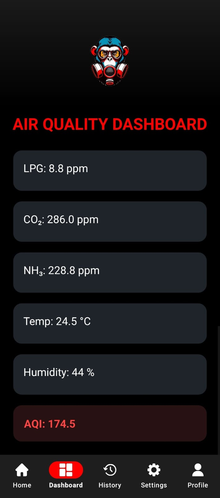
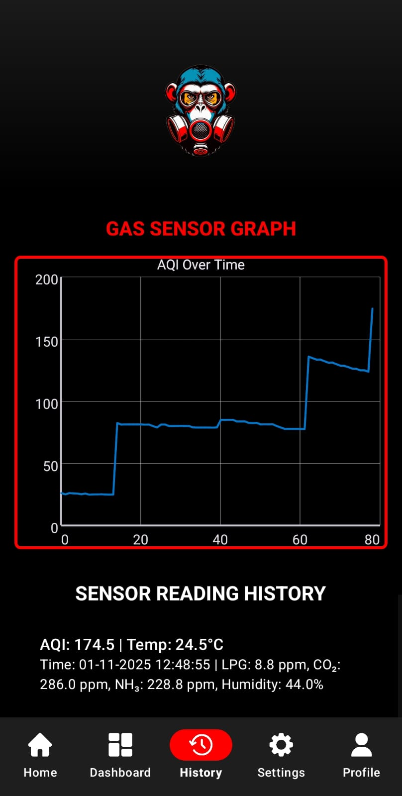
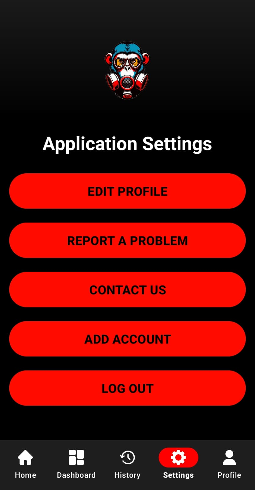
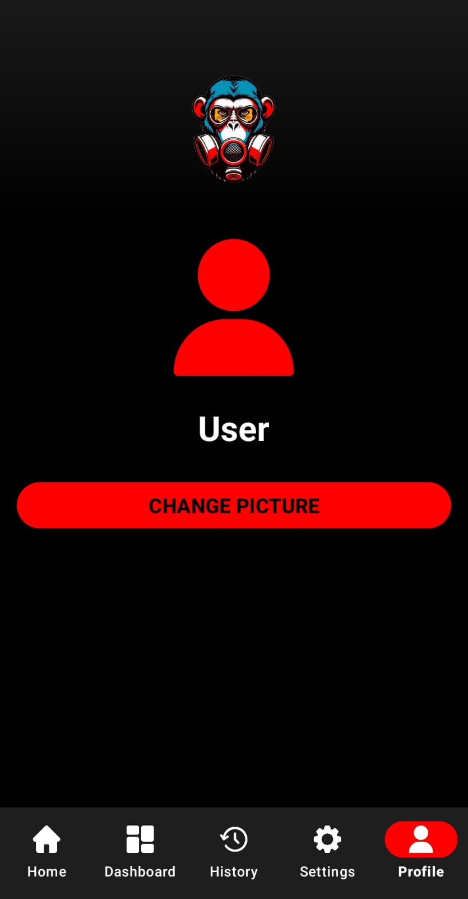

# GasMonkeys - IoT Gas Detection System

A comprehensive IoT gas detection and air quality monitoring system featuring real-time sensor data collection, cloud storage, and mobile visualization.

## 🌟 Overview

GasMonkeys is an end-to-end IoT solution that monitors environmental conditions and gas concentrations using an ESP32-C6 microcontroller, processes data through a cloud-based C# API, and displays real-time and historical data on an Android mobile application.

## 📊 Monitored Parameters

- **LPG (Liquefied Petroleum Gas)** - Detects propane and butane leaks
- **CO₂ (Carbon Dioxide)** - Monitors carbon dioxide levels
- **NH₃ (Ammonia)** - Tracks ammonia concentration
- **Temperature** - Ambient temperature measurement
- **Humidity** - Relative humidity percentage


## 🏗️ System Architecture

### Hardware
- **Microcontroller**: Arduino ESP32-C6 board
- **Sensors**: Gas sensors for LPG, CO₂, NH₃ detection (MQ2, MQ135, Temperature + humidity)
- **Connectivity**: WiFi-enabled ESP32-C6 for cloud communication

### Backend
- **API Framework**: C# ASP.NET Core Web API
- **Hosting**: Microsoft Azure Cloud Platform
- **Database**: Google Firebase

### Mobile Application
- **Platform**: Android
- **Features**:
  - Real-time sensor data display
  - Historical data visualization with graphs
  - Alert notifications for dangerous gas levels
  - Connection management for ESP32 devices

## 🚀 Features

### Real-Time Monitoring
- Live sensor readings updated at regular intervals
- Color-coded indicators for safe/warning/danger levels
- Push notifications for threshold breaches

### Historical Data Analysis
- Interactive graphs displaying sensor trends in real time

### Cloud Integration
- Secure data transmission to Azure and Firebase backend
- Reliable data storage and retrieval

## 📱 Android App Screenshots









## 🔧 Installation & Setup

### ESP32-C6 Setup

1. **Install Arduino IDE** and add ESP32 board support
2. **Install required libraries**:
```
   - WiFi.h
   - HTTPClient.h
   - ArduinoJson.h
   - DHT.h (for temperature/humidity)
```
3. **Configure WiFi credentials** in the Arduino sketch
4. **Set API endpoint** URL to your Azure API
5. **Upload sketch** to ESP32-C6 board


## 📊 API Endpoints
```
GET  /api/sensors/latest          - Get latest sensor readings
GET  /api/sensors/history         - Get historical data
POST /api/sensors/data            - Submit sensor data (ESP32)
GET  /api/sensors/device/{id}     - Get specific device data
```

## 🎯 Threshold Values

| Parameter | Safe | Warning | Danger |
|-----------|------|---------|--------|
| LPG       | <120 ppm | 180-200 ppm | >200 ppm |
| CO₂       | <100 ppm | 200-205 ppm | >210 ppm |
| NH₃       | <25 ppm | 25-50 ppm | >50 ppm |


## 🛠️ Technologies Used

- **Embedded**: Arduino C++, ESP32-C6 SDK
- **Backend**: C#, ASP.NET Core
- **Cloud**: Microsoft Azure and Google Firebase (API Hosting, Realtime Database)
- **Mobile**: Java/Kotlin, Android SDK, MPAndroidChart
- **Communication**: REST API


## 👥 Team: GasMonkeys

Dhruv Rathod - ST10109298
Mud-dath-thir Daniels - ST10301862 
Chandler Prins - ST10268042 


Gareth Elie - ST10076171 
Noah de Boer - ST10284617 
Keenan Davis - ST10201316 

## 📄 License

This project is licensed under the [MIT License](LICENSE) – feel free to use, modify, and distribute it with attribution.


## 📞 Support

For issues or questions, please open an issue on GitHub or contact the GasMonkeys team.

---

**Built with ❤️ by the GasMonkeys Team**
